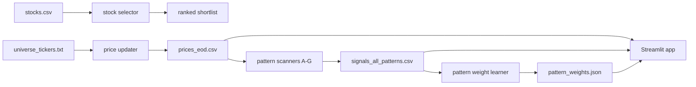

# stock-operator

This repo is a small stock research and trigger workspace.

In plain words, it does two jobs:

1. It helps you shortlist stocks from a fundamentals-and-momentum CSV.
2. It scans end-of-day price data and tells you which stocks look interesting for the next session.

## The two big parts

### 1. stock_selector

This side is the simple ranking engine.

You feed it a CSV with things like price, market cap, returns, ROE, P/E, and volume. It gives you a ranked list and a rough budget allocation.

Main file:

- stock_selector/scripts/stock-selector.py

More detail:

- stock_selector/docs/data-documentation.md

### 2. stock_triggers

This side is the daily swing-trade engine.

It updates price history, runs multiple pattern detectors, scores the signals, learns which pattern families have been stronger historically, and shows everything in a Streamlit UI.

Main files:

- stock_triggers/scripts/update_prices_yf.py
- stock_triggers/scripts/generate_triggers_pattern_a.py
- stock_triggers/scripts/generate_signals_all_patterns.py
- stock_triggers/scripts/compute_pattern_weights.py
- stock_triggers/ui/app.py

More detail:

- stock_triggers/README.md

## Repo map

```text
stock-operator/
├── stock_selector/
│   ├── data/
│   ├── docs/
│   └── scripts/
├── stock_triggers/
│   ├── data/
│   ├── docs/
│   ├── scripts/
│   └── ui/
├── requirements.txt
└── README.md
```

## Quick mental model



## Setup

Create a virtual environment and install dependencies:

```bash
python3 -m venv stockpy11
source stockpy11/bin/activate
pip install -r requirements.txt
```

If your machine needs a custom CA bundle for HTTPS, export it before running the data fetch scripts:

```bash
export SSL_CERT_FILE=/path/to/tgt-ca-bundle.crt
export REQUESTS_CA_BUNDLE=$SSL_CERT_FILE
export CURL_CA_BUNDLE=$SSL_CERT_FILE
```

If you do not need a custom certificate bundle, skip that part.

## Fast start

### Run the selector

```bash
python stock_selector/scripts/stock-selector.py --budget 50000 --top-n 10
```

### Run the trigger pipeline manually

```bash
python stock_triggers/scripts/update_prices_yf.py \
  --user-agent Brilliant \
  --days 1200 \
  --pause-seconds 0.8 \
  --overwrite \
  --universe-file stock_triggers/data/universe_tickers.txt

python stock_triggers/scripts/generate_triggers_pattern_a.py
python stock_triggers/scripts/generate_signals_all_patterns.py
python stock_triggers/scripts/compute_pattern_weights.py
python stock_triggers/scripts/compute_signal_penalty_weights.py
python stock_triggers/scripts/generate_triggers_pattern_a.py
python stock_triggers/scripts/generate_signals_all_patterns.py --backfill-history
python stock_triggers/scripts/compute_signal_stop_risk_model.py --feature-set scores_only
python stock_triggers/scripts/generate_triggers_pattern_a.py
python stock_triggers/scripts/generate_signals_all_patterns.py --backfill-history
streamlit run stock_triggers/ui/app.py
```

## Auto-update What's New on master push

The repo now includes a pre-push hook that can refresh [stock_triggers/data/whats_new.json](stock_triggers/data/whats_new.json) from the commits you are about to push to `master`.

One-time setup for this clone:

```bash
git config core.hooksPath .githooks
chmod +x .githooks/pre-push
```

How it behaves:

1. When you push to `master`, the hook inspects the commits in the outgoing push.
2. It writes a new auto-generated top entry into `stock_triggers/data/whats_new.json`.
3. It creates a dedicated commit named `Update What's New for master push`.
4. It stops that first push on purpose.
5. You run the same `git push` command again, and the second push sends both your original commits and the generated What's New commit.

Why it stops the first push: Git computes the ref update before `pre-push` runs, so a commit created inside the hook is not reliably included in that same push. Stopping once keeps the process safe and deterministic.

Manual fallback:

```bash
stockpy11/bin/python stock_triggers/scripts/update_whats_new.py
git add stock_triggers/data/whats_new.json
git commit -m "Update What's New for master push"
```

## What gets produced

Important output files on the trigger side:

- stock_triggers/data/prices_eod.csv
- stock_triggers/data/signals_pattern_a.csv
- stock_triggers/data/sell_signals_pattern_a.csv
- stock_triggers/data/signals_all_patterns.csv
- stock_triggers/data/pattern_weights.json
- stock_triggers/data/signal_penalty_weights.json
- stock_triggers/data/signal_stop_risk_model.json
- stock_triggers/data/stock_scores.csv

## How the trigger score works

The total signal score is basically built like this:

$$
\\text{Signal Score}
= \operatorname{clip}_{[0,100]}\left(
0.20T + 0.20S + 0.13V + 0.14R + 0.03I + B_{\text{ma}} + B_{\text{pattern}} + B_{\text{consensus}}
\right)
$$

Where:

- $T$ = trend score
- $S$ = setup score
- $V$ = volume score
- $R$ = risk score
- $I$ = RSI score
- $B_{\text{ma}}$ = moving-average slope bonus
- $B_{\text{pattern}}$ = learned pattern-family bonus
- $B_{\text{consensus}}$ = extra boost when multiple patterns agree on the same ticker/date

That means the score is not just “did a pattern fire?” It is more like “how strong was the whole setup?”

## Separate Stop-Risk Score

The repo now also maintains a separate calibrated stop-risk model alongside the
existing heuristic `signal_score`.

This path is intentionally separate so the original signal logic is not
contaminated.

It does three things:

1. Builds explicit stop-related labels from historical signals.
2. Trains a stop-risk model using the selected feature set from the current score components, family,
  crowding/extension/gap features, ATR shock, and market-regime features.
3. Applies isotonic calibration so higher reliability scores correspond to lower
  historical stop-hit probability.

Important signal columns now include:

- `signal_stop_risk`
- `signal_stop_risk_5d`
- `signal_gap_through_stop_risk`
- `signal_mae_exceeds_stop_risk`
- `signal_reliability_score`

The reliability score is derived as:

$$
	ext{Reliability Score} = \operatorname{round}\left(100 \times (1 - P(\text{stop before target}))\right)
$$

So the heuristic `signal_score` still means setup quality, while
`signal_reliability_score` means calibrated stop-loss safety.

For evaluation and model selection, prefer the raw `signal_stop_risk`
probability instead of the rounded reliability score. The rounded score is
fine for display, but the raw probability preserves more ordering detail for
rank-based tests.

## Walk-Forward Evaluation

To compare stop-risk feature sets without data leakage, use the monthly
walk-forward evaluator.

It does the following:

1. Keeps only signal rows whose full hold window is observable in price data.
2. Trains on prior months only.
3. Scores the next unseen month using raw `signal_stop_risk`.
4. Repeats month by month.
5. Reports Spearman rank correlation and low-risk vs high-risk tail separation.

Example:

```bash
python stock_triggers/scripts/evaluate_stop_risk_walk_forward.py \
  --summary-out stock_triggers/data/stop_risk_walk_forward_summary.csv \
  --monthly-out stock_triggers/data/stop_risk_walk_forward_monthly.csv
```

This compares several candidate feature sets on untouched future months:

- `full`
- `full_no_family`
- `scores_only`
- `scores_plus_row_context`
- `scores_plus_regime`

The summary CSV ranks candidates by out-of-sample Spearman correlation between
raw `signal_stop_risk` and realized `stop_before_target`, then by the stop-rate
gap between the highest-risk and lowest-risk quintiles.

The current production workflow trains the stop-risk artifact with the `scores_only`
feature set so scheduled refreshes keep using the same selected model family.

## Automation

The repo now has two main GitHub Actions workflows.

### 1. Full Refresh Pipeline

This is the main scheduled workflow.

It runs automatically on weekdays, refreshes a long rolling price history, and does the full rebuild:

1. Refresh prices.
2. Build Pattern A signals.
3. Build all-pattern history with `--backfill-history`.
4. Recompute learned pattern weights.
5. Recompute learned row-level penalty weights and rebuild the final signal files.
6. Recompute the separate stop-risk model with `--feature-set scores_only` and rebuild the final signal files again with calibrated reliability scores.
7. Generate stock health scores.
8. Commit updated CSV and JSON outputs.
9. Optionally send Telegram updates.

Use this when you want the repo data to be fully normalized again.

### 2. Incremental Signals

This is a manual workflow for ad hoc runs.

It is not scheduled.

By default it only updates the latest available signal date and writes the new rows into the saved signal files. It also refreshes the learned penalty artifact and retrains the stop-risk artifact with `--feature-set scores_only` so manual runs stay aligned with the full refresh pipeline. You can also choose whether to refresh prices first, recompute pattern weights, commit the outputs, and send Telegram. If you do choose price refresh here, it uses the same longer history window as the full refresh workflow.

Use this when you want a quick latest-date signal update without doing a full historical rebuild.

There is also a notify-only workflow that just sends a message from the already saved files.

## Daily Git And Data Workflow

If you want local runs to use the latest dataset files from origin, and you want origin to remain the source of truth for generated trigger data, use this routine.

### Start of day or before a local run

1. Make sure the remote data refresh has already run, or manually trigger the `Full Refresh Pipeline` workflow if you need fully rebuilt data.
2. If you only need latest-date signals, you can manually trigger the `Incremental Signals` workflow instead.
3. Pull the latest code and data from origin before you start working.

```bash
git fetch origin
git update-index --no-skip-worktree stock_triggers/data/signals_pattern_a.csv
git restore stock_triggers/data/signals_pattern_a.csv
git pull --rebase origin master
git update-index --skip-worktree stock_triggers/data/signals_pattern_a.csv
```

That gives you the latest data currently committed on `origin/master`.

### End of day or when you want to publish code

1. Commit your local code and docs.
2. Rebase on top of the latest `origin/master`.
3. Push your code.

```bash
git add .
git commit -m "your message"
git update-index --no-skip-worktree stock_triggers/data/signals_pattern_a.csv
git restore stock_triggers/data/signals_pattern_a.csv
git pull --rebase origin master
git push origin master
git update-index --skip-worktree stock_triggers/data/signals_pattern_a.csv
```

### Why this workflow exists

- `origin/master` is the source of truth for generated datasets.
- The GitHub Actions pipeline refreshes the main trigger data files on a schedule.
- Local code changes should be pushed normally, but local generated data should not override the remote-managed versions.
- `signals_pattern_a.csv` is still a tracked file, so it must be reset before pull/rebase if it changed locally.

### Quick rule

- Before local runs: pull latest remote data.
- Before push: commit, rebase, then push.
- After the remote workflow refreshes data: pull again if you want the refreshed datasets locally.

## Which docs to read next

- If you want the trading engine overview: stock_triggers/README.md
- If you want the exact daily flow: stock_triggers/docs/how_to_use.md
- If you want the pattern logic and real historical example charts: stock_triggers/docs/patterns.md
- If you want the UI guide: stock_triggers/ui/README.md
- If you want the selector side: stock_selector/docs/data-documentation.md
