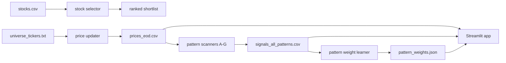

# stock-operator

This repo is a small stock research and trigger workspace.

In plain words, it does two jobs:

1. It helps you shortlist stocks from a fundamentals-and-momentum CSV.
2. It scans end-of-day price data and tells you which stocks look interesting for the next session.

## The two big parts

### 1. stock_selector

This side is the simple ranking engine.

You feed it a CSV with things like price, market cap, returns, ROE, P/E, and volume. It gives you a ranked list and a rough budget allocation.

Main file:

- stock_selector/scripts/stock-selector.py

More detail:

- stock_selector/docs/data-documentation.md

### 2. stock_triggers

This side is the daily swing-trade engine.

It updates price history, runs multiple pattern detectors, scores the signals, learns which pattern families have been stronger historically, and shows everything in a Streamlit UI.

Main files:

- stock_triggers/scripts/update_prices_yf.py
- stock_triggers/scripts/generate_triggers_pattern_a.py
- stock_triggers/scripts/generate_signals_all_patterns.py
- stock_triggers/scripts/compute_pattern_weights.py
- stock_triggers/ui/app.py

More detail:

- stock_triggers/README.md

## Repo map

```text
stock-operator/
├── stock_selector/
│   ├── data/
│   ├── docs/
│   └── scripts/
├── stock_triggers/
│   ├── data/
│   ├── docs/
│   ├── scripts/
│   └── ui/
├── requirements.txt
└── README.md
```

## Quick mental model



## Setup

Create a virtual environment and install dependencies:

```bash
python3 -m venv stockpy11
source stockpy11/bin/activate
pip install -r requirements.txt
```

If your machine needs a custom CA bundle for HTTPS, export it before running the data fetch scripts:

```bash
export SSL_CERT_FILE=/path/to/tgt-ca-bundle.crt
export REQUESTS_CA_BUNDLE=$SSL_CERT_FILE
export CURL_CA_BUNDLE=$SSL_CERT_FILE
```

If you do not need a custom certificate bundle, skip that part.

## Fast start

### Run the selector

```bash
python stock_selector/scripts/stock-selector.py --budget 50000 --top-n 10
```

### Run the trigger pipeline manually

```bash
python stock_triggers/scripts/update_prices_yf.py \
  --user-agent Brilliant \
  --days 1200 \
  --pause-seconds 0.8 \
  --overwrite \
  --universe-file stock_triggers/data/universe_tickers.txt

python stock_triggers/scripts/generate_triggers_pattern_a.py
python stock_triggers/scripts/generate_signals_all_patterns.py
python stock_triggers/scripts/compute_pattern_weights.py
streamlit run stock_triggers/ui/app.py
```

## What gets produced

Important output files on the trigger side:

- stock_triggers/data/prices_eod.csv
- stock_triggers/data/signals_pattern_a.csv
- stock_triggers/data/sell_signals_pattern_a.csv
- stock_triggers/data/signals_all_patterns.csv
- stock_triggers/data/pattern_weights.json
- stock_triggers/data/stock_scores.csv

## How the trigger score works

The total signal score is basically built like this:

$$
\\text{Signal Score}
= \operatorname{clip}_{[0,100]}\left(
0.20T + 0.20S + 0.13V + 0.14R + 0.03I + B_{\text{ma}} + B_{\text{pattern}} + B_{\text{consensus}}
\right)
$$

Where:

- $T$ = trend score
- $S$ = setup score
- $V$ = volume score
- $R$ = risk score
- $I$ = RSI score
- $B_{\text{ma}}$ = moving-average slope bonus
- $B_{\text{pattern}}$ = learned pattern-family bonus
- $B_{\text{consensus}}$ = extra boost when multiple patterns agree on the same ticker/date

That means the score is not just “did a pattern fire?” It is more like “how strong was the whole setup?”

## Automation

The repo is also set up for scheduled GitHub Actions runs.

Main ideas:

1. Refresh prices.
2. Build Pattern A signals.
3. Build all-pattern signals.
4. Recompute learned pattern weights.
5. Commit updated CSV and JSON outputs.
6. Optionally send Telegram updates.

There is also a notify-only workflow that just sends a message from the already saved files.

## Which docs to read next

- If you want the trading engine overview: stock_triggers/README.md
- If you want the exact daily flow: stock_triggers/docs/how_to_use.md
- If you want the pattern logic: stock_triggers/docs/patterns.md
- If you want the UI guide: stock_triggers/ui/README.md
- If you want the selector side: stock_selector/docs/data-documentation.md
