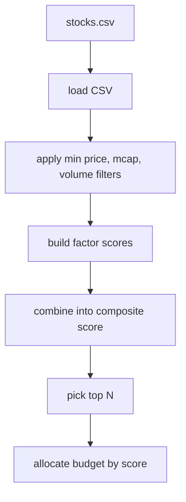

# Stock Selector Guide

This side of the repo is the simple stock-ranking tool.

It is intentionally not fancy. It reads one CSV, filters junk, builds factor scores, ranks the remaining names, and prints a suggested allocation plan.

## What it is good for

Use it when you want a quick shortlist from a fundamentals-and-momentum table.

Good examples:

- "Which 10 names look best from this universe?"
- "If I had 50,000 rupees, how might I spread it across the strongest names?"
- "Can I remove tiny, illiquid, weak candidates before I look at charts?"

## What it reads

Default input file:

- stock_selector/data/stocks.csv

You can override the path with --file.

## What the script does step by step



## Current factor model

The selector uses four buckets:

1. momentum
2. profitability
3. valuation
4. volatility

The current weights in code are:

$$
	ext{Composite Score}
= 0.35M + 0.25P + 0.20V_a + 0.20V_o
$$

Where:

- $M$ = momentum score
- $P$ = profitability score
- $V_a$ = valuation score
- $V_o$ = volatility score

More specifically:

- momentum comes from a 50/50 blend of 6-month and 12-month returns
- profitability comes from ROE
- valuation uses P/E, where lower is better
- volatility uses 1-year volatility, where lower is better

Each factor is min-max normalized to the 0 to 1 range before combination.

## Input columns

The script is happiest when these columns exist:

- Ticker
- Name
- Sector
- Price
- MarketCap
- AvgVolume
- PE
- PB
- ROE
- Return_6M
- Return_12M
- Volatility_1Y

Some are optional in practice, but the best results come when most of them are populated.

## Filters before scoring

The script first removes names that fail the basic sanity checks:

- minimum price
- minimum market cap
- minimum average volume

This is just a simple way to avoid penny-stock and illiquidity clutter.

## Run it

From the repo root:

```bash
python stock_selector/scripts/stock-selector.py \
	--budget 50000 \
	--top-n 10
```

## Useful flags

- --file: custom CSV path
- --budget: total rupee budget
- --top-n: how many names to keep
- --min-price: minimum allowed stock price
- --min-mcap: minimum market cap
- --min-avg-volume: minimum average volume
- column-name override flags if your CSV headers differ

## How allocation is done

Once the top names are chosen, the budget is spread in proportion to composite score:

$$
	ext{Allocation}_i
= \text{Budget} \times \frac{\text{Composite Score}_i}{\sum_j \text{Composite Score}_j}
$$

So stronger names get more capital.

## Output you should expect

The script prints a ranked table with fields like:

- ticker
- name
- sector
- price
- market cap
- average volume
- momentum
- ROE
- PE
- volatility
- composite_score
- allocation
- approximate expected return

## Practical reading of the output

Treat it like a ranking lens, not like a buy order generator.

Good use:

- build a shortlist
- compare names quickly
- keep your universe cleaner before sending stocks into the trigger side

Bad use:

- assuming the highest composite score must be bought
- assuming the expected return printout is a forecast

The selector is just a disciplined first pass.
