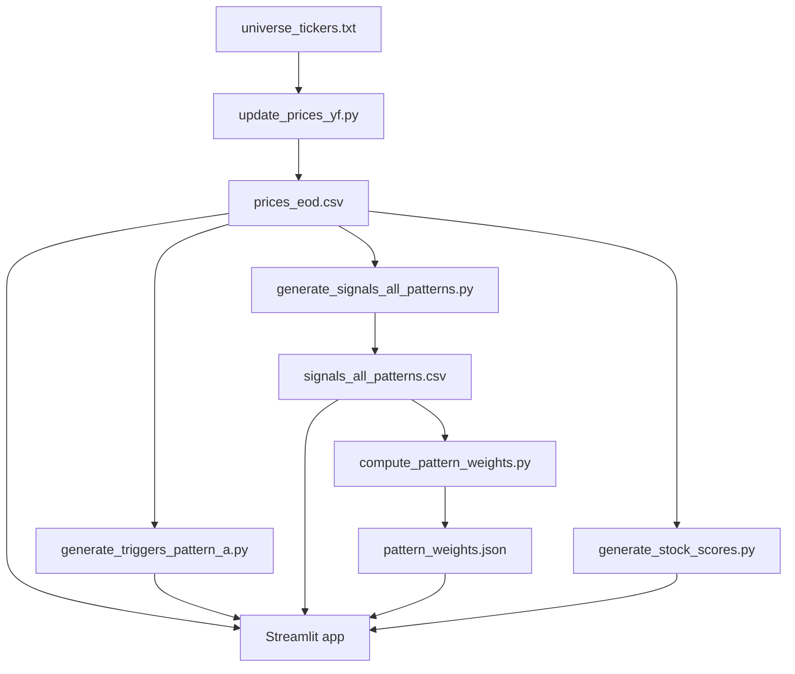

# Stock Triggers

This folder is the trading-signal side of the repo.

If you want the shortest possible description, it is this:

1. Pull daily end-of-day prices.
2. Scan for bullish setups.
3. Score them.
4. Show the best ones in the app.
5. Keep a history so you can backtest and learn from it.

## What lives here

### Raw-ish market data

- prices_eod.csv: the main end-of-day OHLCV history file.
- universe_tickers.txt: the list of tickers to track.

### Signal outputs

- signals_pattern_a.csv: Pattern A buy signals.
- sell_signals_pattern_a.csv: Pattern A sell-side checks.
- signals_all_patterns.csv: combined Pattern A-G signal history.

### Learned weights

- candle_weights.json: historical candle enhancer weights.
- pattern_weights.json: historical pattern-family weights.

### UI and supporting files

- app.py: Streamlit app.
- stock_scores.csv: stock-level health / relative-strength style scores.
- external_factors.csv: market context file for lab work.
- ticker_sector_map.csv: ticker-to-sector mapping.
- whats_new.json: release-note style entries shown in Tomorrow's Picks and Backtesting Lab.

## The working flow



## Main scripts and what they do

### update_prices_yf.py

Gets price history from Yahoo's chart endpoint and writes stock_triggers/data/prices_eod.csv.

### update_prices_bhavcopy.py

Alternative price updater using NSE bhavcopy data.

### generate_triggers_pattern_a.py

Builds Pattern A buy signals and Pattern A sell signals.

It now also reads learned pattern-family weights, so Pattern A rows can include:

- score_pattern
- pattern_bonus
- signal_score with the family bonus already applied

### generate_signals_all_patterns.py

Builds the combined multi-pattern signal history for pattern families A through G.

### compute_pattern_weights.py

Looks at historical signals and forward outcomes, then turns that into pattern family bonuses.

In plain language: it asks, “which families have actually helped lately?”

### generate_stock_scores.py

Builds stock-level scores that the UI uses as an extra quality layer.

### build_pattern_doc_charts.py

Builds the chart images used by `stock_triggers/docs/patterns.md`.

It uses the saved price history and saved signal history to render real historical examples for pattern families A through G, including:

- OHLC candles
- SMA20, SMA50, and SMA200 overlays
- volume with 20-day average
- RSI(14)
- MACD and signal line
- family-specific overlays like breakout levels, Bollinger bands, VWAP, or resistance

Run it when the underlying price or signal files change and you want the docs examples refreshed:

```bash
python stock_triggers/scripts/build_pattern_doc_charts.py
```

### daily_triggers_telegram.py

Runs the pipeline and sends a summary message, usually from automation, not from your laptop.

## The scoring idea

Each signal gets a weighted score, then a couple of bonuses can be added.

$$
\\text{Final Score}
= \operatorname{clip}_{[0,100]}\left(
\\text{base components} + \text{MA slope bonus} + \text{pattern family bonus} + \text{consensus bonus}
\right)
$$

The five base components are weighted like this:

$$
\\text{base components}
= 0.20T + 0.20S + 0.13V + 0.14R + 0.03I
$$

That is why a signal with the same pattern name can still get a very different final score.

## What the app focuses on

The app has two main navigation modes:

1. Tomorrow's Picks
2. Backtesting Lab

Tomorrow's Picks is the fast “what should I inspect next?” view.

Backtesting Lab is the “show me how this would have behaved” view.

There is also portfolio and tracking logic behind the scenes, but the main user flow is centered around those two modes.

## Good files to read next

- stock_triggers/docs/how_to_use.md
- stock_triggers/docs/patterns.md
    Contains the pattern explanations plus real historical chart examples.
- stock_triggers/docs/data-source.md
- stock_triggers/docs/phone-alerts-telegram.md
- stock_triggers/ui/README.md

## Automating What's New

If this clone enables the repo hook path with `git config core.hooksPath .githooks`, pushes to `master` will auto-refresh [stock_triggers/data/whats_new.json](stock_triggers/data/whats_new.json) and prepend a matching entry in [stock_triggers/docs/CHANGELOG.md](stock_triggers/docs/CHANGELOG.md) from the unpushed commit list.

The hook creates a separate commit named `Update What's New for master push` and then stops that first push. Re-run the same push command once, and the second push will include the generated commit.
