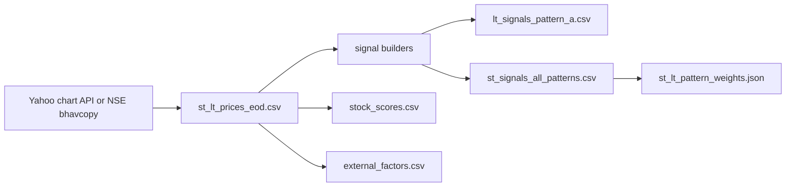

# Data Sources And Files

This page is about where the trigger engine gets its data, what files it writes, and which files the rest of the system depends on.

## The one file everything depends on

The core market data file is:

- stock_triggers/data/st_lt_prices_eod.csv

Almost everything on the trigger side starts from this file.

## Main data flow



## Price data

### Preferred source: Yahoo chart endpoint

Script:

- stock_triggers/scripts/update_prices_yf.py

Why it is preferred here:

- direct HTTP requests
- easy pacing and user-agent control
- simple overwrite/merge behavior

Normal command:

```bash
python stock_triggers/scripts/update_prices_yf.py \
  --user-agent Brilliant \
  --days 1200 \
  --pause-seconds 0.8 \
  --overwrite \
  --universe-file stock_triggers/data/universe_tickers.txt
```

### Alternative source: NSE bhavcopy

Script:

- stock_triggers/scripts/update_prices_bhavcopy.py

Use this if you want an alternate source or are troubleshooting Yahoo fetch issues.

Example:

```bash
python stock_triggers/scripts/update_prices_bhavcopy.py \
  --tickers RELIANCE.NS TCS.NS INFY.NS \
  --start 2025-01-01 \
  --end 2026-03-15
```

## Canonical schema for st_lt_prices_eod.csv

The file is expected to contain:

- Date
- Ticker
- Open
- High
- Low
- Close
- AdjClose
- Volume

Rows are effectively identified by:

$$
(\text{Date}, \text{Ticker})
$$

So duplicate rows should be thought of as a data problem.

## Signal files

### lt_signals_pattern_a.csv

This is the Pattern A-focused output.

It is still useful because Pattern A has its own pipeline and sell-side tracking.

### st_signals_all_patterns.csv

This is the more important history file for the modern app flow.

It stores one scored row per ticker/date/pattern outcome history, including fields like:

- pattern
- pattern_family
- entry_price
- stop_price
- score_trend
- score_setup
- score_volume
- score_rsi
- score_risk
- score_pattern
- pattern_bonus
- signal_score
- consensus_count

## Learned weight files

### st_lt_pattern_weights.json

This file is created by compute_pattern_weights.py.

It includes:

- a weight for each family A through G
- baseline win rate
- total signals analyzed
- per-family stats like count, win rate, loss rate, edge, confidence, score_pattern, and weight

It is basically the historical calibration layer.

### st_lt_candle_weights.json

This is the same idea but for candle-shape enhancers used by the app.

## Market-context files

### external_factors.csv

Built by:

- stock_triggers/scripts/build_external_factors.py

Used for broader market context in lab-style analysis.

### ticker_sector_map.csv

Also built by the external factors workflow.

Used for sector-aware comparisons and mapping.

### FII/DII flow updates

Script:

- stock_triggers/scripts/update_fii_dii_flows.py

This can enrich the external factors file with institutional flow data.

## Universe files

### universe_tickers.txt

This is the main tracked universe.

### stock_universe/*.csv

These are supporting index-constituent lists used by the app's “add more stocks” flow.

## Selector-side file

The selector uses its own separate input file:

- stock_selector/data/stocks.csv

That file is not the same thing as st_lt_prices_eod.csv. One is a curated factor table. The other is raw-ish daily market history.

## Good operational rule

If the app looks wrong, check these files in this order:

1. st_lt_prices_eod.csv
2. st_signals_all_patterns.csv
3. st_lt_pattern_weights.json
4. stock_scores.csv

Most downstream weirdness starts upstream.
