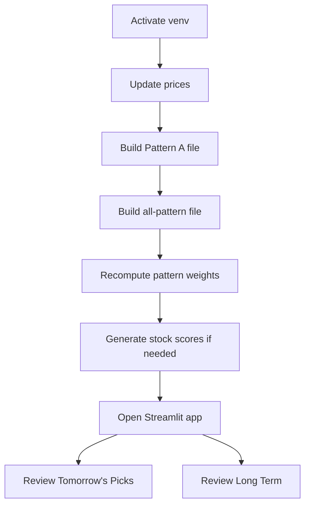

# How To Use Stock Triggers

This is the practical, day-to-day guide.

If you only want the short version, it is this:

1. Update prices.
2. Build signals.
3. Refresh learned weights.
4. Open the app.
5. Look at tomorrow's picks and the long term.

## Daily flow in one picture



## 1. Activate the environment

From the repo root:

```bash
source stockpy11/bin/activate
```

If your machine needs a custom CA bundle for HTTPS calls, set it too:

```bash
export SSL_CERT_FILE=./tgt-ca-bundle.crt
export REQUESTS_CA_BUNDLE=$SSL_CERT_FILE
export CURL_CA_BUNDLE=$SSL_CERT_FILE
```

## 2. Decide your stock universe

The trigger engine reads tickers from:

- stock_triggers/data/universe_tickers.txt

It is one ticker per line.

Example:

```text
RELIANCE.NS
TCS.NS
INFY.NS
SBIN.NS
```

If you change this file, just rerun the price update step.

## 3. Refresh prices

This is the normal command:

```bash
python stock_triggers/scripts/update_prices_yf.py \
  --user-agent Brilliant \
  --days 1200 \
  --pause-seconds 0.8 \
  --overwrite \
  --universe-file stock_triggers/data/universe_tickers.txt
```

What it does:

- fetches OHLCV history
- rebuilds stock_triggers/data/st_lt_prices_eod.csv
- keeps the whole trigger engine working from one clean file

## 4. Build Pattern A signals

If you want the Pattern A-only output file refreshed:

```bash
python stock_triggers/scripts/long_term/generate_lt_signals.py
```

That updates:

- stock_triggers/data/lt_signals_pattern_a.csv
- stock_triggers/data/lt_sell_signals.csv

You can also run a historical date manually:

```bash
python stock_triggers/scripts/long_term/generate_lt_signals.py \
  --as-of-date 2026-03-13 \
  --breakout-days 40 \
  --volume-multiplier 1.5 \
  --stop-pct 7.0
```

## 5. Build the combined all-pattern file

This is the more important file for the current app flow:

```bash
python stock_triggers/scripts/short_term/generate_st_signals.py
```

That updates:

- stock_triggers/data/st_signals_all_patterns.csv

This file includes pattern families:

- A: breakout
- B: pullback rebound
- C: MACD crossover
- D: RSI bounce
- E: Bollinger squeeze breakout
- F: VWAP reclaim
- G: VCP breakout

## 6. Refresh learned pattern weights

After the all-pattern file is ready, refresh the learned family bonuses:

```bash
python stock_triggers/scripts/compute_pattern_weights.py
```

That updates:

- stock_triggers/data/st_lt_pattern_weights.json

This file is the system's way of saying:

“From the saved signal history, which pattern families have recently had better edge?”

## 7. Refresh stock scores if you want the extra ranking layer

```bash
python stock_triggers/scripts/generate_stock_scores.py
```

That updates:

- stock_triggers/data/stock_scores.csv

## 8. Open the app

```bash
streamlit run stock_triggers/ui/app.py
```

## 9. Use the two main app screens

### Tomorrow's Picks

This is the quick decision screen.

What it does now:

- prefers live price data from st_lt_prices_eod.csv
- recalculates Patterns A-G for the latest market date when that data is present
- uses the all-pattern signal set if available
- applies learned pattern-family bonuses
- defaults to a high minimum score filter
- falls back to recent signals if there are no fresh picks

### Long Term

This is where you test ideas more seriously.

What it does now:

- uses saved signal history when possible
- rebuilds from prices only if the all-pattern history file is missing
- shows signal outcomes, days held, return, and score fields
- respects a stop-exit lockout window before stop exits are allowed
- lets you cap max days held in the filtered view

## 10. What to actually look at

When you review a signal, the useful fields are:

- signal_date
- ticker
- pattern
- pattern_family
- entry_price
- stop_price
- score_trend
- score_setup
- score_volume
- score_risk
- score_rsi
- score_pattern
- pattern_bonus
- ma_slope_bonus
- signal_score

## The score in plain English

The score is not magic. It is just a weighted blend.

$$
  ext{score} = \text{base setup quality} + \text{bonuses} - \text{weakness penalties baked into components}
$$

More explicitly:

$$
  ext{Signal Score}
= \operatorname{clip}_{[0,100]}\left(
0.20T + 0.20S + 0.13V + 0.14R + 0.03I + B_{\text{ma}} + B_{\text{pattern}} + B_{\text{consensus}}
\right)
$$

So if two rows both say “Pattern F”, they still may not deserve the same attention.

## Recommended manual routine

If you want a sensible daily routine, use this one:

1. Refresh prices after market close.
2. Build Pattern A and all-pattern files.
3. Recompute pattern weights.
4. Open Tomorrow's Picks.
5. Ignore low-score clutter.
6. Check only the top names on charts.
7. Use Long Term before changing your rules.

## One-command pipeline option

If you want the scripted daily flow instead of running commands one by one:

```bash
python stock_triggers/scripts/daily_triggers_telegram.py --skip-refresh
```

Or with refresh included:

```bash
python stock_triggers/scripts/daily_triggers_telegram.py
```

That is mostly meant for hosted automation, especially when Telegram sending is involved.
