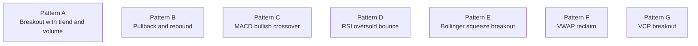

# Patterns A To G

This file explains the actual pattern families that exist in the current codebase.

The easiest way to read this is:

- A and G are breakout-style ideas.
- B is a pullback idea.
- C and D are indicator cross ideas.
- E is a squeeze idea.
- F is a reclaim idea.

## Pattern map

## Shared idea across the whole system

Every pattern is looking for a bullish setup, but the code does not stop there.

After a pattern fires, the engine still scores the row based on trend, setup quality, volume, risk, RSI context, MA slope, and learned family strength.

So a signal is really:

$$
    ext{signal} = \text{pattern trigger} + \text{quality score}
$$

## A. Pattern A: Trend breakout with volume

Plain-English version:

The stock is already in an uptrend, and today it pushes above a recent closing high with strong volume.

Main conditions:

- SMA50 > SMA200
- close > SMA50
- close > SMA200
- close > previous N-day high close
- volume above the 20-day average by a chosen multiplier

Typical use:

- momentum continuation
- higher-quality “already strong” names

Important knobs:

- breakout_days
- volume_multiplier
- stop_pct
- optional ATR or structure stop modes in the UI detector path

## B. Pattern B: Pullback and rebound near SMA20

Plain-English version:

The stock is still in an uptrend, but instead of breaking out, it has pulled back toward the 20-day average and started bouncing again.

Main conditions:

- SMA50 > SMA200
- close still above SMA50
- close near SMA20
- today closes above yesterday by a minimum rebound amount
- volume is at least mildly supportive

Why it exists:

- catches continuation entries before a big breakout bar
- gives a less extended entry than Pattern A sometimes does

## C. Pattern C: MACD bullish crossover

Plain-English version:

The MACD line was below the signal line, and now it has crossed above it while the broader trend is still healthy.

Main conditions:

- SMA50 > SMA200
- MACD previous <= signal previous
- MACD now > signal now
- volume above a relaxed threshold

Why it exists:

- gives a momentum re-acceleration type entry
- often catches trend resumption before price makes a dramatic breakout

## D. Pattern D: RSI oversold bounce

Plain-English version:

The stock was oversold on RSI, and now RSI has bounced back above the threshold while the broader trend is still up.

Main conditions:

- SMA50 > SMA200
- RSI yesterday below threshold
- RSI today back above threshold
- light-to-moderate volume support

Why it exists:

- tries to catch “washout then bounce” behavior inside a bigger uptrend

Important note:

In the current learned weight file, D is one of the weaker families, so it may carry little or no family bonus.

## E. Pattern E: Bollinger squeeze breakout

Plain-English version:

The stock has gone quiet, volatility has tightened, and then price breaks out above the upper Bollinger Band.

Main conditions:

- SMA50 > SMA200
- Bollinger Band width is at or near a recent low
- close breaks above the upper band
- volume is above average

Why it exists:

- looks for compression followed by expansion

## F. Pattern F: VWAP reclaim

Plain-English version:

On end-of-day data, the stock was trading below a rolling VWAP approximation and then closes back above it on stronger volume.

Main conditions:

- SMA50 > SMA200
- previous close <= rolling VWAP approximation
- current close > rolling VWAP approximation
- volume spike

Why it exists:

- looks for regained control after short-term weakness
- often shows up as a crisp “buyers took back the line” setup

## G. Pattern G: VCP breakout

Plain-English version:

The stock forms a volatility contraction pattern, with several pullbacks getting shallower, then breaks out above resistance.

Main conditions:

- uptrend already in place
- at least three pullbacks can be found from pivots
- each pullback is shallower than the one before it
- breakout above recent resistance
- volume support
- volume dry-up during the contraction phase

Why it exists:

- this is the most structure-heavy pattern in the set
- it is trying to identify coiled breakouts, not just “price went up today”

## The score formula used after a pattern fires

The base score is currently:

$$
0.20T + 0.20S + 0.13V + 0.14R + 0.03I
$$

Then the engine can add:

$$
B_{\text{ma}} + B_{\text{pattern}} + B_{\text{consensus}}
$$

and finally clip the result into the 0 to 100 range.

## Why learned pattern weights matter

The project now stores a learned family bonus in pattern_weights.json.

That means a strong family can contribute more to the final score than a weak family.

Very roughly:

$$
B_{\text{pattern}} = \frac{\text{family score}}{100} \times 30
$$

So if a family has a historical score of 80 out of 100, it can contribute close to 24 of the possible 30 family points.

## Practical reading guide

If you want a simple working interpretation:

- Pattern A: classic strong-stock breakout
- Pattern B: pullback continuation
- Pattern C: momentum crossover
- Pattern D: oversold rebound
- Pattern E: squeeze expansion
- Pattern F: reclaim and go
- Pattern G: coiled breakout

And if two families trigger together on the same stock and date, that is usually worth extra attention because the system can add a consensus bonus too.
