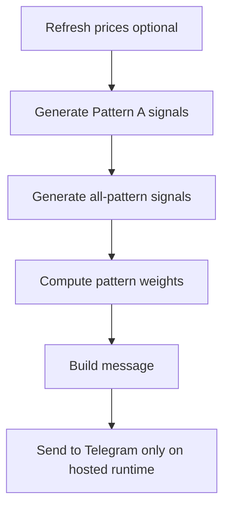

# Telegram Phone Alerts

This part sends a daily summary message to Telegram.

But there is one important rule in the current code:

## Important: local sends are blocked on purpose

The script only allows actual Telegram sending from hosted runtimes such as:

- GitHub Actions
- Streamlit Cloud or similar hosted runtime flags

That means if you run the script locally on your laptop, it can still run the pipeline, but the real Telegram send is intentionally blocked by policy.

That is not a bug. It is how the script is written right now.

## What the Telegram pipeline does now

Current flow:



So this is no longer just a Pattern A ping. It now includes the wider pipeline status too.

## 1. Create a Telegram bot

1. Open Telegram.
2. Chat with BotFather.
3. Run /newbot.
4. Save the bot token.

It usually looks something like:

```text
123456789:AAExampleToken
```

## 2. Get your chat ID

1. Send any message to your bot.
2. Open this URL in a browser, replacing the token:

```text
https://api.telegram.org/botBOT_TOKEN/getUpdates
```

3. Look for the chat id in the response JSON.

## 3. Store the secrets

Preferred option: use secrets.yml in the repo root.

```yaml
TELEGRAM_BOT_TOKEN: "your_bot_token"
TELEGRAM_CHAT_ID: "your_chat_id"
```

Template file:

- secrets.yml.example

The script checks credentials in this order:

1. CLI args
2. environment variables
3. secrets.yml

## 4. You can also use environment variables

```bash
export TELEGRAM_BOT_TOKEN="your_bot_token"
export TELEGRAM_CHAT_ID="your_chat_id"
```

## 5. Run the pipeline script

```bash
python stock_triggers/scripts/daily_triggers_telegram.py
```

What it tries to do:

1. refresh prices
2. generate Pattern A signals
3. generate all-pattern signals
4. recompute pattern weights
5. build the Telegram message
6. send the message if hosted runtime policy allows it

## 6. Useful flags

### Skip refresh

```bash
python stock_triggers/scripts/daily_triggers_telegram.py --skip-refresh
```

Use this when prices are already updated.

### Send-only mode

```bash
python stock_triggers/scripts/daily_triggers_telegram.py --send-only
```

Use this when you only want a message from existing saved files.

In send-only mode, the script does not refresh prices and does not generate fresh signals.

## 7. What the message contains

The current message includes:

- today's date
- today's Pattern A rows if any
- signal score if available
- entry price
- pattern label
- production app URL
- pipeline step status for prices, triggers, all-patterns, and pattern-weights

## 8. Best deployment approach

If you want real phone alerts, the cleanest path is:

1. put the repo on GitHub
2. enable GitHub Actions
3. store TELEGRAM_BOT_TOKEN and TELEGRAM_CHAT_ID as GitHub secrets
4. let the scheduled workflow run there

That matches the current hosted-runtime-only sending rule.

## 9. What to expect locally

When run locally, think of the script as a pipeline tester, not as the final delivery mechanism.

It is good for:

- checking whether the pipeline succeeds
- checking whether the message text looks right
- checking whether files get updated

It is not good for:

- actual Telegram delivery from a local machine, unless you change the runtime policy in code
