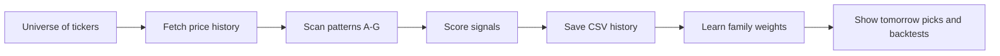

# What This Workspace Is Doing

This file is the plain-English explanation.

If somebody asks, “what is this thing doing every day?”, this is the answer.

## Short answer

It watches a list of stocks, updates their end-of-day prices, checks several bullish setups, scores them, remembers the results, and shows you which names look strongest.

## Slightly longer answer

The engine is doing five jobs at once:

1. Keeping price history up to date.
2. Looking for setups across several pattern families.
3. Scoring each setup instead of treating every signal equally.
4. Learning which pattern families have worked better in the saved history.
5. Turning all of that into something you can read in the Streamlit app.

## The actual loop

## What files matter most

### Input side

- stock_triggers/data/universe_tickers.txt
- stock_triggers/data/st_lt_prices_eod.csv

### Output side

- stock_triggers/data/lt_signals_pattern_a.csv
- stock_triggers/data/st_signals_all_patterns.csv
- stock_triggers/data/st_lt_pattern_weights.json

## What changed versus the old version

The old mental model was basically:

“Pattern A scanner writes one CSV.”

The current mental model is:

“Multi-pattern engine builds a history, learns from it, and the UI uses that bigger picture.”

That matters because the app is no longer just showing raw breakout rows. It is also using:

- all-pattern history
- learned pattern bonuses
- recent fallback logic when there are no fresh picks
- backtest and tracker logic

## How the engine decides what looks strong

There are two layers:

### Layer 1: did the setup trigger?

Each pattern has hard conditions. Example:

- breakout above recent highs
- MACD crossover
- RSI oversold bounce
- VWAP reclaim

### Layer 2: how good is the setup?

That is where the score comes in.

$$
\\text{Signal Score} = \text{components} + \text{bonuses}
$$

With the current weight split:

$$
\\text{components} = 0.20T + 0.20S + 0.13V + 0.14R + 0.03I
$$

and then extra bonuses can be added for:

- strong 50-day moving-average slope
- historically strong pattern family
- multiple patterns agreeing on the same stock/date

## Why there is a separate learned pattern weight file

The project now stores pattern family performance in stock_triggers/data/st_lt_pattern_weights.json.

That means the system can do this:

- give Pattern A more credit if A has been working well historically
- give weaker families less credit
- keep that logic visible instead of hidden in the code

So the app is not saying only “Pattern G fired.”

It is also saying “Pattern G fired, and right now G has this historical edge score.”

## What you should use this workspace for

Good use:

- shortlist tomorrow's chart review candidates
- compare pattern families
- test score filters
- study whether rules are improving or degrading

Bad use:

- blind order placement without chart review
- assuming a signal is a prediction
- assuming a high score guarantees a win

This is a ranking-and-research tool, not an autopilot.
